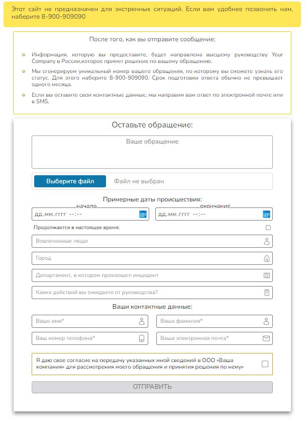
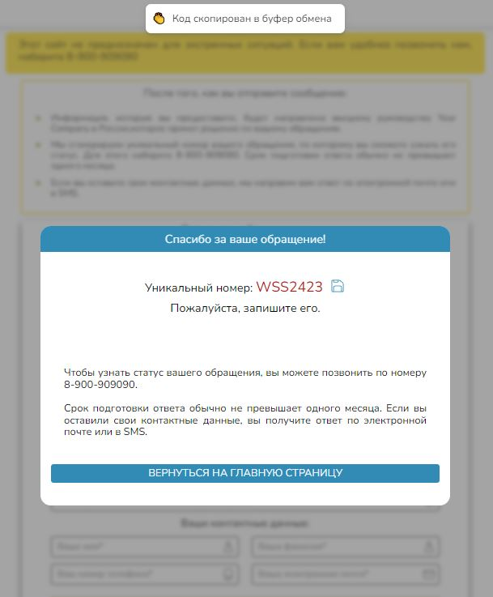

#   React + TypeScript Form for sending data to support service

## Feature : 
- Mobile adaptive 
- Some validation.
- Blocked send button (agreement).
- Ready for attach file.
- Token modal window with copy to clipboard feature(only web version)

## Tech Stack

**Client:** TypeScript, React, Vite

## Screenshots

## Authors

- [@xansochi](https://www.github.com/xansochi)

## Feedback

If you have any feedback, please reach out to us at @xansochi

